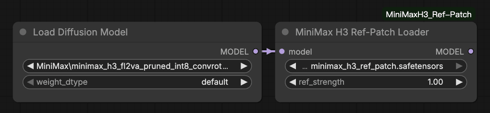

# ComfyUI-TomatoCrypt  
Inject differential values from ref2v into MiniMax-H3 fl2v weight  

## Preview


## Installation

#### Install the node:
```bash
cd ComfyUI/custom_nodes
git clone https://github.com/lihaoyun6/ComfyUI-MiniMaxH3_Ref-Patch.git
```

#### Download model patch:
- Download the patch weight from huggingface: [minimax\_h3\_ref\_patch.safetensors](https://huggingface.co/lihaoyun6/MiniMax-H3-Ref-Patch/blob/main/minimax_h3_ref_patch.safetensors)  
- Put it in `ComfyUI/models/model_patches`  

## Usage 
Use the `MiniMax H3 Ref-Patch Loader` node to select and load model patch, and connect the `fl2v` model to this node.  

> The goal of this project is not to replicate the behavior of ref2v, but to simulate the effect of **[KJ's LoRA](https://huggingface.co/Kijai/MiniMax-H3-experimental/blob/main/loras/minimax_h3_ref_lora_rank_256_bf16.safetensors)**  

## Credits
- [ComfyUI](https://github.com/comfyanonymous/ComfyUI) @comfyanonymous
